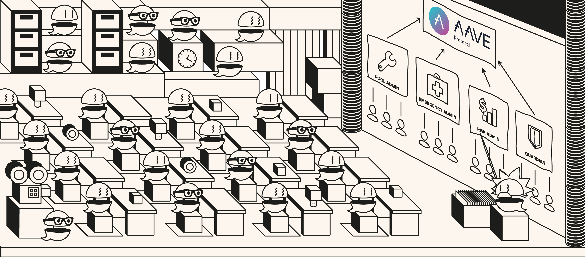

# Aave Permissions Book

Tool to index and visualise all the permissions on the whole Aave smart contracts ecosystem.

## Table of contents
- [Description](#Description)
- [Permissions](#Permissions)
- [Usage](#Usage)
- [License](#License)

## Description

The Aave Protocol smart contracts require different permissions to execute its different methods. These permissions are also hold by different addresses, being other smart contracts, EOAs or multi-sigs.
This repository contains and easy directory of tables showing which permissions are needed to execute the functions of the different contracts conforming the Aave Protocol, and the owners of said permissions.


## Permissions

A [permissions document](./out) has been created for every pool of every network where the Aave Protocol has been deployed. 
These documents contain tables with the following information:
- **Contracts**: This table has information about the contracts of the Aave protocol.
  - contract: Name of the contract.
  - proxyAdmin: If the contract follows the Proxy Pattern, it will show the proxyAdmin address. The proxyAdmin has permissions to upgrade the implementation.
  - modifier: Name of the gate method that controls who can call a function. There is an entry for every modifier that a contract has.
  - permission owner: Name of the contract that holds the permission to call the modifier.
  - functions: Name of the functions of the contract that are gated by the modifier.
- **Guardians**: This table holds the list of addresses with permissions to call certain methods, excluding those of the Aave governance. Normally a Guardian is a multi-sig with permission to call some methods, following a mandate from the Aave governance.  
- **Roles**: This table enumerates the different roles that a protocol can have, and the contracts who have that role. A role has permissions to call certain functions gated by modifiers.

### Permissions directory
| Network |System type |Tables |
|----------|----------|----------|
|  MAINNET |  V3 |  [Permissions](./out/MAINNET-V3.md#contracts) | |--------|--------|--------|
|  MAINNET |  GHO |  [Permissions](./out/MAINNET-GHO.md#contracts) | |--------|--------|--------|
|  MAINNET |  GOV_V2 |  [Permissions](./out/MAINNET-GOV_V2.md#contracts) | |--------|--------|--------|
|  MAINNET |  V2 |  [Permissions](./out/MAINNET-V2.md#contracts) | |--------|--------|--------|
|  MAINNET |  V2_ARC |  [Permissions](./out/MAINNET-V2_ARC.md#contracts) | |--------|--------|--------|
|  MAINNET |  V2_AMM |  [Permissions](./out/MAINNET-V2_AMM.md#contracts) | |--------|--------|--------|
|  MAINNET |  SAFETY_MODULE |  [Permissions](./out/MAINNET-SAFETY_MODULE.md#contracts) | |--------|--------|--------|
|  MAINNET |  V2_MISC |  [Permissions](./out/MAINNET-V2_MISC.md#contracts) | |--------|--------|--------|
|  OPTIMISM |  V3 |  [Permissions](./out/OPTIMISM-V3.md#contracts) | |--------|--------|--------|
|  BINANCE |  V3 |  [Permissions](./out/BINANCE-V3.md#contracts) | |--------|--------|--------|
|  GNOSIS |  V3 |  [Permissions](./out/GNOSIS-V3.md#contracts) | |--------|--------|--------|
|  POLYGON |  V3 |  [Permissions](./out/POLYGON-V3.md#contracts) | |--------|--------|--------|
|  POLYGON |  V2 |  [Permissions](./out/POLYGON-V2.md#contracts) | |--------|--------|--------|
|  FANTOM_OPERA |  V3 |  [Permissions](./out/FANTOM_OPERA-V3.md#contracts) | |--------|--------|--------|
|  BASE |  V3 |  [Permissions](./out/BASE-V3.md#contracts) | |--------|--------|--------|
|  ARBITRUM_ONE |  V3 |  [Permissions](./out/ARBITRUM_ONE-V3.md#contracts) | |--------|--------|--------|
|  AVALANCHE |  V3 |  [Permissions](./out/AVALANCHE-V3.md#contracts) | |--------|--------|--------|
|  AVALANCHE |  V2 |  [Permissions](./out/AVALANCHE-V2.md#contracts) | |--------|--------|--------|
       
    
## Usage

To generate the permissions json, and the subsequent permissions tables:

### Installation

```
  npm install
  cp .env.example .env // this will copy the example .env to the actual .env
```

### Scripts

To generate the permissions json, execute:
```
  npm run modifiers:generate
```

To generate the permissions tables, execute:
```
  npm run tables:create
```


## License
This repository is under [MIT License](./LICENSE)
